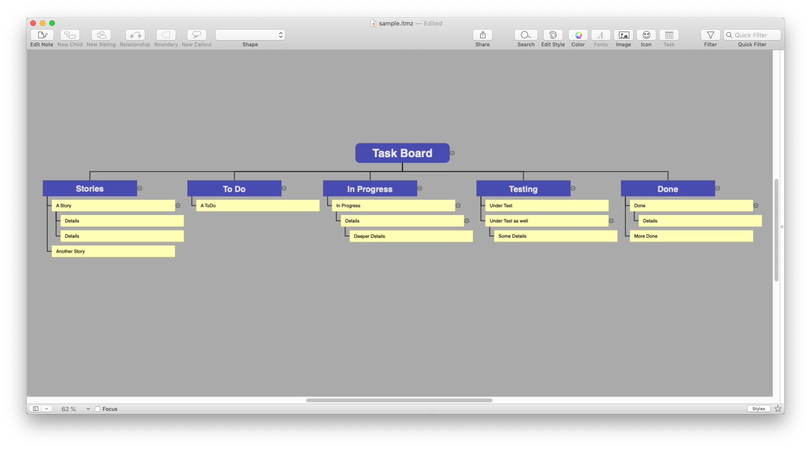

# ithoughtsx-styles
Collection of styles for the [iThoughtsX](https://www.toketaware.com) mind mapper.

## Ideas
A very simple, distraction-free style without much formatting.

[Ideas.itmz-style](styles/Ideas.itmz-style)

## oneM2M Resource

A vertical style that can be used to model and present
[oneM2M](http://www.onem2m.org) resources and resource trees.

[oneM2MResource.itmz-style](styles/oneM2MResource.itmz-style)

## Organigram

A top-down style that emphasizes the first level.

[Organigram.itmz-style](styles/Organigram.itmz-style)

## SDT

A horizontal style that emphasizes the first and second level.  
The original purpose was to format the mindmap output from [SDTTool](https://github.com/Homegateway/SDTTool).

[SDT.itmz-style](styles/SDT.itmz-style)

## Task Board

A vertical style that is suited as a task board for ordering and priotizing
tasks. 

[TaskBoard.itmz-style](styles/TaskBoard.itmz-style)

---

## License
These styles are available under the Creative Commons Attribution 4.0 license.  
See the [LICENSE](LICENSE) file or [https://creativecommons.org/licenses/by/4.0/](https://creativecommons.org/licenses/by/4.0/) for further details.
